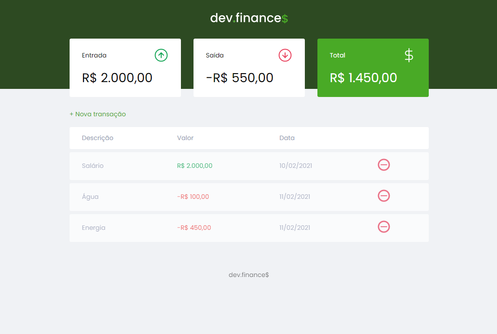
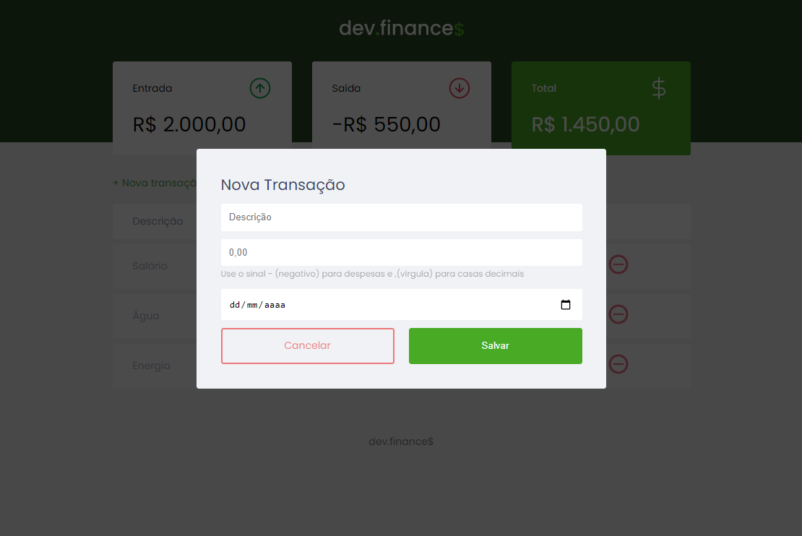

<h1 align="center">
    Maratona Discovery
</h1>

    <a href="#Tecnologias">Tecnologias</a>&nbsp;&nbsp;&nbsp;|&nbsp;&nbsp;&nbsp;
    <a href="#Projeto">Projeto</a>&nbsp;&nbsp;&nbsp;

## Tecnologias

    Esse projeto foi desenvolvido com as seguintes tecnologia:

- [HTML5](https://www.w3schools.com/html/default.asp)
- [CSS](https://www.w3schools.com/css/default.asp)
- [Javascript](https://www.w3schools.com/js/default.asp)

 

## Projeto

Desenvolvido aplicação em html5, utiliznado javascript e css. Este projeto foi desenvolvido na maratona discovery fornecida pela rocketseat comandado pelo Mack Brito.

 

 

# Resultado

<h1 align="center">
   
     
     
   
</h1>
